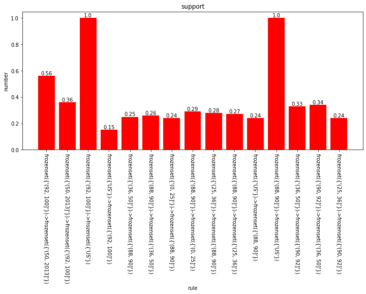

互评作业二  频繁模式与关联规则挖掘

邱柯铭 3220201078

具体流程为将两个数据集进行合并 对price 和 points进行离散化处理

并挖掘其中的关联关系 并进行数据可视化

```python
import matplotlib.pyplot as plt
import matplotlib
from collections import Counter
import warnings
import seaborn as sns
warnings.filterwarnings('ignore')
```


```python
import numpy as np 
import pandas as pd
```


```python
train = pd.read_csv('C:/Users/15192/Desktop/数据挖掘/winemag-data-130k-v2.csv')
```


```python
train.info()
```

    <class 'pandas.core.frame.DataFrame'>
    RangeIndex: 129971 entries, 0 to 129970
    Data columns (total 14 columns):
     #   Column                 Non-Null Count   Dtype  
    ---  ------                 --------------   -----  
     0   Unnamed: 0             129971 non-null  int64  
     1   country                129908 non-null  object 
     2   description            129971 non-null  object 
     3   designation            92506 non-null   object 
     4   points                 129971 non-null  int64  
     5   price                  120975 non-null  float64
     6   province               129908 non-null  object 
     7   region_1               108724 non-null  object 
     8   region_2               50511 non-null   object 
     9   taster_name            103727 non-null  object 
     10  taster_twitter_handle  98758 non-null   object 
     11  title                  129971 non-null  object 
     12  variety                129970 non-null  object 
     13  winery                 129971 non-null  object 
    dtypes: float64(1), int64(2), object(11)
    memory usage: 13.9+ MB


```python
train1 = pd.read_csv('C:/Users/15192/Desktop/数据挖掘/winemag-data_first150k.csv')
```


```python
train1.info()
```

    <class 'pandas.core.frame.DataFrame'>
    RangeIndex: 150930 entries, 0 to 150929
    Data columns (total 11 columns):
     #   Column       Non-Null Count   Dtype  
    ---  ------       --------------   -----  
     0   Unnamed: 0   150930 non-null  int64  
     1   country      150925 non-null  object 
     2   description  150930 non-null  object 
     3   designation  105195 non-null  object 
     4   points       150930 non-null  int64  
     5   price        137235 non-null  float64
     6   province     150925 non-null  object 
     7   region_1     125870 non-null  object 
     8   region_2     60953 non-null   object 
     9   variety      150930 non-null  object 
     10  winery       150930 non-null  object 
    dtypes: float64(1), int64(2), object(8)
    memory usage: 12.7+ MB


```python
data = pd.concat([train, train1], axis=0)
```


```python
data.info()
```

    <class 'pandas.core.frame.DataFrame'>
    Int64Index: 280901 entries, 0 to 150929
    Data columns (total 14 columns):
     #   Column                 Non-Null Count   Dtype  
    ---  ------                 --------------   -----  
     0   Unnamed: 0             280901 non-null  int64  
     1   country                280833 non-null  object 
     2   description            280901 non-null  object 
     3   designation            197701 non-null  object 
     4   points                 280901 non-null  int64  
     5   price                  258210 non-null  float64
     6   province               280833 non-null  object 
     7   region_1               234594 non-null  object 
     8   region_2               111464 non-null  object 
     9   taster_name            103727 non-null  object 
     10  taster_twitter_handle  98758 non-null   object 
     11  title                  129971 non-null  object 
     12  variety                280900 non-null  object 
     13  winery                 280901 non-null  object 
    dtypes: float64(1), int64(2), object(11)
    memory usage: 32.1+ MB


```python
data.head()
```


<div>
<style scoped>
    .dataframe tbody tr th:only-of-type {
        vertical-align: middle;
    }

    .dataframe tbody tr th {
        vertical-align: top;
    }
    
    .dataframe thead th {
        text-align: right;
    }
</style>
<table border="1" class="dataframe">
  <thead>
    <tr style="text-align: right;">
      <th></th>
      <th>Unnamed: 0</th>
      <th>country</th>
      <th>description</th>
      <th>designation</th>
      <th>points</th>
      <th>price</th>
      <th>province</th>
      <th>region_1</th>
      <th>region_2</th>
      <th>taster_name</th>
      <th>taster_twitter_handle</th>
      <th>title</th>
      <th>variety</th>
      <th>winery</th>
    </tr>
  </thead>
  <tbody>
    <tr>
      <th>0</th>
      <td>0</td>
      <td>Italy</td>
      <td>Aromas include tropical fruit, broom, brimston...</td>
      <td>Vulkà Bianco</td>
      <td>87</td>
      <td>NaN</td>
      <td>Sicily &amp; Sardinia</td>
      <td>Etna</td>
      <td>NaN</td>
      <td>Kerin O’Keefe</td>
      <td>@kerinokeefe</td>
      <td>Nicosia 2013 Vulkà Bianco  (Etna)</td>
      <td>White Blend</td>
      <td>Nicosia</td>
    </tr>
    <tr>
      <th>1</th>
      <td>1</td>
      <td>Portugal</td>
      <td>This is ripe and fruity, a wine that is smooth...</td>
      <td>Avidagos</td>
      <td>87</td>
      <td>15.0</td>
      <td>Douro</td>
      <td>NaN</td>
      <td>NaN</td>
      <td>Roger Voss</td>
      <td>@vossroger</td>
      <td>Quinta dos Avidagos 2011 Avidagos Red (Douro)</td>
      <td>Portuguese Red</td>
      <td>Quinta dos Avidagos</td>
    </tr>
    <tr>
      <th>2</th>
      <td>2</td>
      <td>US</td>
      <td>Tart and snappy, the flavors of lime flesh and...</td>
      <td>NaN</td>
      <td>87</td>
      <td>14.0</td>
      <td>Oregon</td>
      <td>Willamette Valley</td>
      <td>Willamette Valley</td>
      <td>Paul Gregutt</td>
      <td>@paulgwine</td>
      <td>Rainstorm 2013 Pinot Gris (Willamette Valley)</td>
      <td>Pinot Gris</td>
      <td>Rainstorm</td>
    </tr>
    <tr>
      <th>3</th>
      <td>3</td>
      <td>US</td>
      <td>Pineapple rind, lemon pith and orange blossom ...</td>
      <td>Reserve Late Harvest</td>
      <td>87</td>
      <td>13.0</td>
      <td>Michigan</td>
      <td>Lake Michigan Shore</td>
      <td>NaN</td>
      <td>Alexander Peartree</td>
      <td>NaN</td>
      <td>St. Julian 2013 Reserve Late Harvest Riesling ...</td>
      <td>Riesling</td>
      <td>St. Julian</td>
    </tr>
    <tr>
      <th>4</th>
      <td>4</td>
      <td>US</td>
      <td>Much like the regular bottling from 2012, this...</td>
      <td>Vintner's Reserve Wild Child Block</td>
      <td>87</td>
      <td>65.0</td>
      <td>Oregon</td>
      <td>Willamette Valley</td>
      <td>Willamette Valley</td>
      <td>Paul Gregutt</td>
      <td>@paulgwine</td>
      <td>Sweet Cheeks 2012 Vintner's Reserve Wild Child...</td>
      <td>Pinot Noir</td>
      <td>Sweet Cheeks</td>
    </tr>
  </tbody>
</table>
</div>


```python
print(data.isnull().sum)
```

    <bound method DataFrame.sum of         Unnamed: 0  country  description  designation  points  price  \
    0            False    False        False        False   False   True   
    1            False    False        False        False   False  False   
    2            False    False        False         True   False  False   
    3            False    False        False        False   False  False   
    4            False    False        False        False   False  False   
    ...            ...      ...          ...          ...     ...    ...   
    150925       False    False        False         True   False  False   
    150926       False    False        False        False   False  False   
    150927       False    False        False        False   False  False   
    150928       False    False        False        False   False  False   
    150929       False    False        False         True   False  False   
    
            province  region_1  region_2  taster_name  taster_twitter_handle  \
    0          False     False      True        False                  False   
    1          False      True      True        False                  False   
    2          False     False     False        False                  False   
    3          False     False      True        False                   True   
    4          False     False     False        False                  False   
    ...          ...       ...       ...          ...                    ...   
    150925     False     False      True         True                   True   
    150926     False     False      True         True                   True   
    150927     False     False      True         True                   True   
    150928     False     False      True         True                   True   
    150929     False     False      True         True                   True   
    
            title  variety  winery  
    0       False    False   False  
    1       False    False   False  
    2       False    False   False  
    3       False    False   False  
    4       False    False   False  
    ...       ...      ...     ...  
    150925   True    False   False  
    150926   True    False   False  
    150927   True    False   False  
    150928   True    False   False  
    150929   True    False   False  
    
    [280901 rows x 14 columns]>


```python
data1=data.dropna(axis=0)
```


```python
data1.head()
```


<div>
<style scoped>
    .dataframe tbody tr th:only-of-type {
        vertical-align: middle;
    }

    .dataframe tbody tr th {
        vertical-align: top;
    }
    
    .dataframe thead th {
        text-align: right;
    }
</style>
<table border="1" class="dataframe">
  <thead>
    <tr style="text-align: right;">
      <th></th>
      <th>Unnamed: 0</th>
      <th>country</th>
      <th>description</th>
      <th>designation</th>
      <th>points</th>
      <th>price</th>
      <th>province</th>
      <th>region_1</th>
      <th>region_2</th>
      <th>taster_name</th>
      <th>taster_twitter_handle</th>
      <th>title</th>
      <th>variety</th>
      <th>winery</th>
    </tr>
  </thead>
  <tbody>
    <tr>
      <th>4</th>
      <td>4</td>
      <td>US</td>
      <td>Much like the regular bottling from 2012, this...</td>
      <td>Vintner's Reserve Wild Child Block</td>
      <td>87</td>
      <td>65.0</td>
      <td>Oregon</td>
      <td>Willamette Valley</td>
      <td>Willamette Valley</td>
      <td>Paul Gregutt</td>
      <td>@paulgwine</td>
      <td>Sweet Cheeks 2012 Vintner's Reserve Wild Child...</td>
      <td>Pinot Noir</td>
      <td>Sweet Cheeks</td>
    </tr>
    <tr>
      <th>10</th>
      <td>10</td>
      <td>US</td>
      <td>Soft, supple plum envelopes an oaky structure ...</td>
      <td>Mountain Cuvée</td>
      <td>87</td>
      <td>19.0</td>
      <td>California</td>
      <td>Napa Valley</td>
      <td>Napa</td>
      <td>Virginie Boone</td>
      <td>@vboone</td>
      <td>Kirkland Signature 2011 Mountain Cuvée Caberne...</td>
      <td>Cabernet Sauvignon</td>
      <td>Kirkland Signature</td>
    </tr>
    <tr>
      <th>23</th>
      <td>23</td>
      <td>US</td>
      <td>This wine from the Geneseo district offers aro...</td>
      <td>Signature Selection</td>
      <td>87</td>
      <td>22.0</td>
      <td>California</td>
      <td>Paso Robles</td>
      <td>Central Coast</td>
      <td>Matt Kettmann</td>
      <td>@mattkettmann</td>
      <td>Bianchi 2011 Signature Selection Merlot (Paso ...</td>
      <td>Merlot</td>
      <td>Bianchi</td>
    </tr>
    <tr>
      <th>25</th>
      <td>25</td>
      <td>US</td>
      <td>Oak and earth intermingle around robust aromas...</td>
      <td>King Ridge Vineyard</td>
      <td>87</td>
      <td>69.0</td>
      <td>California</td>
      <td>Sonoma Coast</td>
      <td>Sonoma</td>
      <td>Virginie Boone</td>
      <td>@vboone</td>
      <td>Castello di Amorosa 2011 King Ridge Vineyard P...</td>
      <td>Pinot Noir</td>
      <td>Castello di Amorosa</td>
    </tr>
    <tr>
      <th>35</th>
      <td>35</td>
      <td>US</td>
      <td>As with many of the Erath 2010 vineyard design...</td>
      <td>Hyland</td>
      <td>86</td>
      <td>50.0</td>
      <td>Oregon</td>
      <td>McMinnville</td>
      <td>Willamette Valley</td>
      <td>Paul Gregutt</td>
      <td>@paulgwine</td>
      <td>Erath 2010 Hyland Pinot Noir (McMinnville)</td>
      <td>Pinot Noir</td>
      <td>Erath</td>
    </tr>
  </tbody>
</table>
</div>


```python
从中可以看到points和price为数值属性，将其离散化
```


```python
number_data = ['points','price']
data1[number_data].describe()
```


<div>
<style scoped>
    .dataframe tbody tr th:only-of-type {
        vertical-align: middle;
    }

    .dataframe tbody tr th {
        vertical-align: top;
    }
    
    .dataframe thead th {
        text-align: right;
    }
</style>
<table border="1" class="dataframe">
  <thead>
    <tr style="text-align: right;">
      <th></th>
      <th>points</th>
      <th>price</th>
    </tr>
  </thead>
  <tbody>
    <tr>
      <th>count</th>
      <td>22387.000000</td>
      <td>22387.000000</td>
    </tr>
    <tr>
      <th>mean</th>
      <td>89.537812</td>
      <td>41.465404</td>
    </tr>
    <tr>
      <th>std</th>
      <td>2.809306</td>
      <td>29.379374</td>
    </tr>
    <tr>
      <th>min</th>
      <td>80.000000</td>
      <td>4.000000</td>
    </tr>
    <tr>
      <th>25%</th>
      <td>88.000000</td>
      <td>25.000000</td>
    </tr>
    <tr>
      <th>50%</th>
      <td>90.000000</td>
      <td>36.000000</td>
    </tr>
    <tr>
      <th>75%</th>
      <td>92.000000</td>
      <td>50.000000</td>
    </tr>
    <tr>
      <th>max</th>
      <td>100.000000</td>
      <td>2013.000000</td>
    </tr>
  </tbody>
</table>
</div>


```python
将points和price分成4个等级，points为低度，中低度,中度，高度，pirce为低价，中低价，中价，高价

points 0-88 88-90 90-92 92-100

price 0-25 25-36 36-50 50-2013

经过处理后的结果如下所示
```


```python
bin = [0,88,90,92,100]
data1['points'] = pd.cut(data1['points'],bin)
data1['points'] = data1['points'].astype('str')
data1.head()
```


<div>
<style scoped>
    .dataframe tbody tr th:only-of-type {
        vertical-align: middle;
    }

    .dataframe tbody tr th {
        vertical-align: top;
    }
    
    .dataframe thead th {
        text-align: right;
    }
</style>
<table border="1" class="dataframe">
  <thead>
    <tr style="text-align: right;">
      <th></th>
      <th>Unnamed: 0</th>
      <th>country</th>
      <th>description</th>
      <th>designation</th>
      <th>points</th>
      <th>price</th>
      <th>province</th>
      <th>region_1</th>
      <th>region_2</th>
      <th>taster_name</th>
      <th>taster_twitter_handle</th>
      <th>title</th>
      <th>variety</th>
      <th>winery</th>
    </tr>
  </thead>
  <tbody>
    <tr>
      <th>4</th>
      <td>4</td>
      <td>US</td>
      <td>Much like the regular bottling from 2012, this...</td>
      <td>Vintner's Reserve Wild Child Block</td>
      <td>(0, 88]</td>
      <td>65.0</td>
      <td>Oregon</td>
      <td>Willamette Valley</td>
      <td>Willamette Valley</td>
      <td>Paul Gregutt</td>
      <td>@paulgwine</td>
      <td>Sweet Cheeks 2012 Vintner's Reserve Wild Child...</td>
      <td>Pinot Noir</td>
      <td>Sweet Cheeks</td>
    </tr>
    <tr>
      <th>10</th>
      <td>10</td>
      <td>US</td>
      <td>Soft, supple plum envelopes an oaky structure ...</td>
      <td>Mountain Cuvée</td>
      <td>(0, 88]</td>
      <td>19.0</td>
      <td>California</td>
      <td>Napa Valley</td>
      <td>Napa</td>
      <td>Virginie Boone</td>
      <td>@vboone</td>
      <td>Kirkland Signature 2011 Mountain Cuvée Caberne...</td>
      <td>Cabernet Sauvignon</td>
      <td>Kirkland Signature</td>
    </tr>
    <tr>
      <th>23</th>
      <td>23</td>
      <td>US</td>
      <td>This wine from the Geneseo district offers aro...</td>
      <td>Signature Selection</td>
      <td>(0, 88]</td>
      <td>22.0</td>
      <td>California</td>
      <td>Paso Robles</td>
      <td>Central Coast</td>
      <td>Matt Kettmann</td>
      <td>@mattkettmann</td>
      <td>Bianchi 2011 Signature Selection Merlot (Paso ...</td>
      <td>Merlot</td>
      <td>Bianchi</td>
    </tr>
    <tr>
      <th>25</th>
      <td>25</td>
      <td>US</td>
      <td>Oak and earth intermingle around robust aromas...</td>
      <td>King Ridge Vineyard</td>
      <td>(0, 88]</td>
      <td>69.0</td>
      <td>California</td>
      <td>Sonoma Coast</td>
      <td>Sonoma</td>
      <td>Virginie Boone</td>
      <td>@vboone</td>
      <td>Castello di Amorosa 2011 King Ridge Vineyard P...</td>
      <td>Pinot Noir</td>
      <td>Castello di Amorosa</td>
    </tr>
    <tr>
      <th>35</th>
      <td>35</td>
      <td>US</td>
      <td>As with many of the Erath 2010 vineyard design...</td>
      <td>Hyland</td>
      <td>(0, 88]</td>
      <td>50.0</td>
      <td>Oregon</td>
      <td>McMinnville</td>
      <td>Willamette Valley</td>
      <td>Paul Gregutt</td>
      <td>@paulgwine</td>
      <td>Erath 2010 Hyland Pinot Noir (McMinnville)</td>
      <td>Pinot Noir</td>
      <td>Erath</td>
    </tr>
  </tbody>
</table>
</div>


```python
bin = [0,25,36,50,2013]
data1['price'] = pd.cut(data1['price'],bin)
data1['price'] = data1['price'].astype('str')
data1.head()
```


<div>
<style scoped>
    .dataframe tbody tr th:only-of-type {
        vertical-align: middle;
    }

    .dataframe tbody tr th {
        vertical-align: top;
    }
    
    .dataframe thead th {
        text-align: right;
    }
</style>
<table border="1" class="dataframe">
  <thead>
    <tr style="text-align: right;">
      <th></th>
      <th>Unnamed: 0</th>
      <th>country</th>
      <th>description</th>
      <th>designation</th>
      <th>points</th>
      <th>price</th>
      <th>province</th>
      <th>region_1</th>
      <th>region_2</th>
      <th>taster_name</th>
      <th>taster_twitter_handle</th>
      <th>title</th>
      <th>variety</th>
      <th>winery</th>
    </tr>
  </thead>
  <tbody>
    <tr>
      <th>4</th>
      <td>4</td>
      <td>US</td>
      <td>Much like the regular bottling from 2012, this...</td>
      <td>Vintner's Reserve Wild Child Block</td>
      <td>(0, 88]</td>
      <td>(50, 2013]</td>
      <td>Oregon</td>
      <td>Willamette Valley</td>
      <td>Willamette Valley</td>
      <td>Paul Gregutt</td>
      <td>@paulgwine</td>
      <td>Sweet Cheeks 2012 Vintner's Reserve Wild Child...</td>
      <td>Pinot Noir</td>
      <td>Sweet Cheeks</td>
    </tr>
    <tr>
      <th>10</th>
      <td>10</td>
      <td>US</td>
      <td>Soft, supple plum envelopes an oaky structure ...</td>
      <td>Mountain Cuvée</td>
      <td>(0, 88]</td>
      <td>(0, 25]</td>
      <td>California</td>
      <td>Napa Valley</td>
      <td>Napa</td>
      <td>Virginie Boone</td>
      <td>@vboone</td>
      <td>Kirkland Signature 2011 Mountain Cuvée Caberne...</td>
      <td>Cabernet Sauvignon</td>
      <td>Kirkland Signature</td>
    </tr>
    <tr>
      <th>23</th>
      <td>23</td>
      <td>US</td>
      <td>This wine from the Geneseo district offers aro...</td>
      <td>Signature Selection</td>
      <td>(0, 88]</td>
      <td>(0, 25]</td>
      <td>California</td>
      <td>Paso Robles</td>
      <td>Central Coast</td>
      <td>Matt Kettmann</td>
      <td>@mattkettmann</td>
      <td>Bianchi 2011 Signature Selection Merlot (Paso ...</td>
      <td>Merlot</td>
      <td>Bianchi</td>
    </tr>
    <tr>
      <th>25</th>
      <td>25</td>
      <td>US</td>
      <td>Oak and earth intermingle around robust aromas...</td>
      <td>King Ridge Vineyard</td>
      <td>(0, 88]</td>
      <td>(50, 2013]</td>
      <td>California</td>
      <td>Sonoma Coast</td>
      <td>Sonoma</td>
      <td>Virginie Boone</td>
      <td>@vboone</td>
      <td>Castello di Amorosa 2011 King Ridge Vineyard P...</td>
      <td>Pinot Noir</td>
      <td>Castello di Amorosa</td>
    </tr>
    <tr>
      <th>35</th>
      <td>35</td>
      <td>US</td>
      <td>As with many of the Erath 2010 vineyard design...</td>
      <td>Hyland</td>
      <td>(0, 88]</td>
      <td>(36, 50]</td>
      <td>Oregon</td>
      <td>McMinnville</td>
      <td>Willamette Valley</td>
      <td>Paul Gregutt</td>
      <td>@paulgwine</td>
      <td>Erath 2010 Hyland Pinot Noir (McMinnville)</td>
      <td>Pinot Noir</td>
      <td>Erath</td>
    </tr>
  </tbody>
</table>
</div>


```python
data1 = data1[['points','price','country','winery']]
data1.head(5)
```


<div>
<style scoped>
    .dataframe tbody tr th:only-of-type {
        vertical-align: middle;
    }

    .dataframe tbody tr th {
        vertical-align: top;
    }
    
    .dataframe thead th {
        text-align: right;
    }
</style>
<table border="1" class="dataframe">
  <thead>
    <tr style="text-align: right;">
      <th></th>
      <th>points</th>
      <th>price</th>
      <th>country</th>
      <th>winery</th>
    </tr>
  </thead>
  <tbody>
    <tr>
      <th>4</th>
      <td>(0, 88]</td>
      <td>(50, 2013]</td>
      <td>US</td>
      <td>Sweet Cheeks</td>
    </tr>
    <tr>
      <th>10</th>
      <td>(0, 88]</td>
      <td>(0, 25]</td>
      <td>US</td>
      <td>Kirkland Signature</td>
    </tr>
    <tr>
      <th>23</th>
      <td>(0, 88]</td>
      <td>(0, 25]</td>
      <td>US</td>
      <td>Bianchi</td>
    </tr>
    <tr>
      <th>25</th>
      <td>(0, 88]</td>
      <td>(50, 2013]</td>
      <td>US</td>
      <td>Castello di Amorosa</td>
    </tr>
    <tr>
      <th>35</th>
      <td>(0, 88]</td>
      <td>(36, 50]</td>
      <td>US</td>
      <td>Erath</td>
    </tr>
  </tbody>
</table>
</div>


```python
选取points,price,country以及winery进行挖掘
利用Apriori算法找出所有的频繁项集
```


    ---------------------------------------------------------------------------
    
    NameError                                 Traceback (most recent call last)
    
    <ipython-input-51-40d90427dd0a> in <module>
    ----> 1 选取points,price,country以及winery进行挖掘
          2 利用Apriori算法找出所有的频繁项集


    NameError: name '选取points' is not defined


```python
from efficient_apriori import apriori
```


```python
data2 = list(zip(*[data1[c].values.tolist() for c in data1]))
```


```python
itemsets, rules = apriori(data2, min_support=0.5, min_confidence=0.9)
```


```python
print(rules)
```

    []


```python
itemsets, rules = apriori(data2, min_support=0.25, min_confidence=0.9)
print(rules)
```

    [{(0, 88]} -> {US}, {(0, 25]} -> {US}, {(36, 50]} -> {US}]


```python
print(itemsets)
```

    {1: {('(0, 88]',): 8282, ('US',): 22387, ('(0, 25]',): 6367, ('(36, 50]',): 5668}, 2: {('(0, 88]', 'US'): 8282, ('(0, 25]', 'US'): 6367, ('(36, 50]', 'US'): 5668}}


```python
可以看出points度数品级和酒的产地之间的关系也较为紧密
```


```python
def createC1( dataSet ):
    C1 = []
    for transaction in np.array(dataSet):
        for item in transaction:
            if [item] not in C1:
                C1.append( [item] )
    C1.sort()
    return list(map( frozenset, C1 ))

def scanD( D, Ck, minSupport ):
    ssCnt = {}
    for tid in D:
        if Ck is not None:
            for can in Ck:
                if can.issubset( tid ):
                    ssCnt[ can ] = ssCnt.get( can, 0) + 1
    numItems = float( len( D ) )
    retList = []
    supportData = {}
    for key in ssCnt:
        support = ssCnt[ key ] / numItems
        if support >= minSupport:
            retList.insert( 0, key )
            supportData[ key ] = support
    return retList, supportData
```


```python
def aprioriGen( Lk, k ):
    retList = []
    lenLk = len( Lk )
    for i in range( lenLk ):
        for j in range( i + 1, lenLk ):
            L1 = list( Lk[ i ] )[ : k - 2 ];
            L2 = list( Lk[ j ] )[ : k - 2 ];
            L1.sort();L2.sort()    
            if L1==L2:
                retList.append( Lk[ i ] | Lk[ j ] ) 
    return retList

def apriori( dataSet, minSupport = 0.5 ):
    C1 = createC1( dataSet )
    D =list( map( set, dataSet ))
    L1, suppData = scanD( D, C1, minSupport )
    L = [ L1 ]
    k = 2
    
    while ( len( L[ k - 2 ] ) > 0 ):
        Ck = aprioriGen( L[ k - 2 ], k )
        Lk, supK = scanD( D, Ck, minSupport )
        suppData.update( supK )
        L.append( Lk )
        k += 1
    return L, suppData
```


```python
newData = list(map(set,np.array(data1)))
L, suppData = apriori(newData, 0.05)
L
```


    [[frozenset({'(92, 100]'}),
      frozenset({'(88, 90]'}),
      frozenset({'(90, 92]'}),
      frozenset({'(25, 36]'}),
      frozenset({'(36, 50]'}),
      frozenset({'(0, 25]'}),
      frozenset({'US'}),
      frozenset({'(50, 2013]'}),
      frozenset({'(0, 88]'})],
     [frozenset({'(50, 2013]', '(92, 100]'}),
      frozenset({'(92, 100]', 'US'}),
      frozenset({'(36, 50]', '(88, 90]'}),
      frozenset({'(0, 25]', '(88, 90]'}),
      frozenset({'(25, 36]', '(88, 90]'}),
      frozenset({'(88, 90]', 'US'}),
      frozenset({'(36, 50]', '(90, 92]'}),
      frozenset({'(25, 36]', '(90, 92]'}),
      frozenset({'(50, 2013]', '(90, 92]'}),
      frozenset({'(90, 92]', 'US'}),
      frozenset({'(0, 88]', '(25, 36]'}),
      frozenset({'(25, 36]', 'US'}),
      frozenset({'(0, 88]', '(36, 50]'}),
      frozenset({'(36, 50]', 'US'}),
      frozenset({'(0, 25]', '(0, 88]'}),
      frozenset({'(0, 25]', 'US'}),
      frozenset({'(0, 88]', 'US'}),
      frozenset({'(50, 2013]', 'US'})],
     [frozenset({'(50, 2013]', '(92, 100]', 'US'}),
      frozenset({'(36, 50]', '(88, 90]', 'US'}),
      frozenset({'(0, 25]', '(88, 90]', 'US'}),
      frozenset({'(25, 36]', '(88, 90]', 'US'}),
      frozenset({'(36, 50]', '(90, 92]', 'US'}),
      frozenset({'(25, 36]', '(90, 92]', 'US'}),
      frozenset({'(50, 2013]', '(90, 92]', 'US'}),
      frozenset({'(0, 88]', '(25, 36]', 'US'}),
      frozenset({'(0, 88]', '(36, 50]', 'US'}),
      frozenset({'(0, 25]', '(0, 88]', 'US'})],
     []]


```python
for tmp, num in suppData.items():
    print(tmp, ':', num)
```

    frozenset({'(0, 88]'}) : 0.3699468441506231
    frozenset({'(50, 2013]'}) : 0.23187564211372672
    frozenset({'US'}) : 1.0
    frozenset({'(0, 25]'}) : 0.2844061285567517
    frozenset({'(36, 50]'}) : 0.25318265064546386
    frozenset({'(25, 36]'}) : 0.23053557868405772
    frozenset({'(90, 92]'}) : 0.24514227006744985
    frozenset({'(88, 90]'}) : 0.23719122705141377
    frozenset({'(92, 100]'}) : 0.14771965873051324
    frozenset({'(50, 2013]', 'US'}) : 0.23187564211372672
    frozenset({'(0, 88]', 'US'}) : 0.3699468441506231
    frozenset({'(0, 25]', 'US'}) : 0.2844061285567517
    frozenset({'(0, 88]', '(0, 25]'}) : 0.18064055031938178
    frozenset({'(36, 50]', 'US'}) : 0.25318265064546386
    frozenset({'(0, 88]', '(36, 50]'}) : 0.06222361191763077
    frozenset({'(25, 36]', 'US'}) : 0.23053557868405772
    frozenset({'(0, 88]', '(25, 36]'}) : 0.09501049716353241
    frozenset({'(90, 92]', 'US'}) : 0.24514227006744985
    frozenset({'(90, 92]', '(50, 2013]'}) : 0.07450752668959663
    frozenset({'(90, 92]', '(25, 36]'}) : 0.055165944521374015
    frozenset({'(90, 92]', '(36, 50]'}) : 0.08433465850716934
    frozenset({'(88, 90]', 'US'}) : 0.23719122705141377
    frozenset({'(88, 90]', '(25, 36]'}) : 0.06508241390092465
    frozenset({'(88, 90]', '(0, 25]'}) : 0.06771787197927369
    frozenset({'(88, 90]', '(36, 50]'}) : 0.0621789431366418
    frozenset({'US', '(92, 100]'}) : 0.14771965873051324
    frozenset({'(50, 2013]', '(92, 100]'}) : 0.08308393263947828
    frozenset({'(0, 88]', '(0, 25]', 'US'}) : 0.18064055031938178
    frozenset({'(0, 88]', '(36, 50]', 'US'}) : 0.06222361191763077
    frozenset({'(0, 88]', '(25, 36]', 'US'}) : 0.09501049716353241
    frozenset({'(90, 92]', 'US', '(50, 2013]'}) : 0.07450752668959663
    frozenset({'(90, 92]', '(25, 36]', 'US'}) : 0.055165944521374015
    frozenset({'(90, 92]', '(36, 50]', 'US'}) : 0.08433465850716934
    frozenset({'(88, 90]', '(25, 36]', 'US'}) : 0.06508241390092465
    frozenset({'(88, 90]', '(0, 25]', 'US'}) : 0.06771787197927369
    frozenset({'(88, 90]', '(36, 50]', 'US'}) : 0.0621789431366418
    frozenset({'US', '(50, 2013]', '(92, 100]'}) : 0.08308393263947828


```python
导出关联规则，计算其支持度和置信度，并对规则进行评价
```


```python
#输入频繁项集列表、频繁项集的支持度字典、最小置信度
#输出包含置信度的规则列表
def generateRules(L, supportData, minConf=0.5):
    bigRuleList = []
    for i in range(1, len(L)):
        for freqSet in L[i]:
            H1 = [frozenset([item]) for item in freqSet]   #规则后件集合
            if (i > 1):
                rulesFromConseq(freqSet, H1, supportData, bigRuleList, minConf)
            else:
                calcConf(freqSet, H1, supportData, bigRuleList, minConf)
    return bigRuleList

#生成候选规则集合
def calcConf(freqSet, H, supportData, brl, minConf=0.5):
    prunedH = []
    for conseq in H:
        conf = supportData[freqSet]/supportData[freqSet-conseq]   #集合相减
        if conf >= minConf:
            print(f'{freqSet-conseq} --> {conseq} conf:{conf}'+ "  support: "+ str(supportData[freqSet]))
            brl.append((freqSet-conseq, conseq, conf, supportData[freqSet]))
            prunedH.append(conseq)
    return prunedH

#对规则进行评估
def rulesFromConseq(freqSet, H, supportData, brl, minConf=0.5):
    m = len(H[0])
    if (len(freqSet) > (m + 1)):
        Hmp1 = aprioriGen(H, m+1)
        Hmp1 = calcConf(freqSet, Hmp1, supportData, brl, minConf)
        if (len(Hmp1) > 1):
            rulesFromConseq(freqSet, Hmp1, supportData, brl, minConf)
```


```python
rules = generateRules(L, suppData, minConf=0.05)
```

    frozenset({'(92, 100]'}) --> frozenset({'(50, 2013]'}) conf:0.5624433020864833  support: 0.08308393263947828
    frozenset({'(50, 2013]'}) --> frozenset({'(92, 100]'}) conf:0.358312463879792  support: 0.08308393263947828
    frozenset({'(92, 100]'}) --> frozenset({'US'}) conf:1.0  support: 0.14771965873051324
    frozenset({'US'}) --> frozenset({'(92, 100]'}) conf:0.14771965873051324  support: 0.14771965873051324
    frozenset({'(36, 50]'}) --> frozenset({'(88, 90]'}) conf:0.24558927311220893  support: 0.0621789431366418
    frozenset({'(88, 90]'}) --> frozenset({'(36, 50]'}) conf:0.2621468926553672  support: 0.0621789431366418
    frozenset({'(0, 25]'}) --> frozenset({'(88, 90]'}) conf:0.23810271713522854  support: 0.06771787197927369
    frozenset({'(88, 90]'}) --> frozenset({'(0, 25]'}) conf:0.28549905838041434  support: 0.06771787197927369
    frozenset({'(25, 36]'}) --> frozenset({'(88, 90]'}) conf:0.2823096299166828  support: 0.06508241390092465
    frozenset({'(88, 90]'}) --> frozenset({'(25, 36]'}) conf:0.2743879472693032  support: 0.06508241390092465
    frozenset({'US'}) --> frozenset({'(88, 90]'}) conf:0.23719122705141377  support: 0.23719122705141377
    frozenset({'(88, 90]'}) --> frozenset({'US'}) conf:1.0  support: 0.23719122705141377
    frozenset({'(36, 50]'}) --> frozenset({'(90, 92]'}) conf:0.3330980945659845  support: 0.08433465850716934
    frozenset({'(90, 92]'}) --> frozenset({'(36, 50]'}) conf:0.34402332361516036  support: 0.08433465850716934
    frozenset({'(25, 36]'}) --> frozenset({'(90, 92]'}) conf:0.23929471032745592  support: 0.055165944521374015
    frozenset({'(90, 92]'}) --> frozenset({'(25, 36]'}) conf:0.22503644314868806  support: 0.055165944521374015
    frozenset({'(50, 2013]'}) --> frozenset({'(90, 92]'}) conf:0.321325370834136  support: 0.07450752668959663
    frozenset({'(90, 92]'}) --> frozenset({'(50, 2013]'}) conf:0.303935860058309  support: 0.07450752668959663
    frozenset({'US'}) --> frozenset({'(90, 92]'}) conf:0.24514227006744985  support: 0.24514227006744985
    frozenset({'(90, 92]'}) --> frozenset({'US'}) conf:1.0  support: 0.24514227006744985
    frozenset({'(25, 36]'}) --> frozenset({'(0, 88]'}) conf:0.41212943228056576  support: 0.09501049716353241
    frozenset({'(0, 88]'}) --> frozenset({'(25, 36]'}) conf:0.2568220236657812  support: 0.09501049716353241
    frozenset({'US'}) --> frozenset({'(25, 36]'}) conf:0.23053557868405772  support: 0.23053557868405772
    frozenset({'(25, 36]'}) --> frozenset({'US'}) conf:1.0  support: 0.23053557868405772
    frozenset({'(36, 50]'}) --> frozenset({'(0, 88]'}) conf:0.24576570218772056  support: 0.06222361191763077
    frozenset({'(0, 88]'}) --> frozenset({'(36, 50]'}) conf:0.16819608790147308  support: 0.06222361191763077
    frozenset({'US'}) --> frozenset({'(36, 50]'}) conf:0.25318265064546386  support: 0.25318265064546386
    frozenset({'(36, 50]'}) --> frozenset({'US'}) conf:1.0  support: 0.25318265064546386
    frozenset({'(0, 25]'}) --> frozenset({'(0, 88]'}) conf:0.6351499921470081  support: 0.18064055031938178
    frozenset({'(0, 88]'}) --> frozenset({'(0, 25]'}) conf:0.48828785317556145  support: 0.18064055031938178
    frozenset({'US'}) --> frozenset({'(0, 25]'}) conf:0.2844061285567517  support: 0.2844061285567517
    frozenset({'(0, 25]'}) --> frozenset({'US'}) conf:1.0  support: 0.2844061285567517
    frozenset({'US'}) --> frozenset({'(0, 88]'}) conf:0.3699468441506231  support: 0.3699468441506231
    frozenset({'(0, 88]'}) --> frozenset({'US'}) conf:1.0  support: 0.3699468441506231
    frozenset({'US'}) --> frozenset({'(50, 2013]'}) conf:0.23187564211372672  support: 0.23187564211372672
    frozenset({'(50, 2013]'}) --> frozenset({'US'}) conf:1.0  support: 0.23187564211372672
    frozenset({'(92, 100]'}) --> frozenset({'(50, 2013]', 'US'}) conf:0.5624433020864833  support: 0.08308393263947828
    frozenset({'(50, 2013]'}) --> frozenset({'(92, 100]', 'US'}) conf:0.358312463879792  support: 0.08308393263947828
    frozenset({'US'}) --> frozenset({'(92, 100]', '(50, 2013]'}) conf:0.08308393263947828  support: 0.08308393263947828
    frozenset({'US'}) --> frozenset({'(88, 90]', '(36, 50]'}) conf:0.0621789431366418  support: 0.0621789431366418
    frozenset({'(36, 50]'}) --> frozenset({'(88, 90]', 'US'}) conf:0.24558927311220893  support: 0.0621789431366418
    frozenset({'(88, 90]'}) --> frozenset({'(36, 50]', 'US'}) conf:0.2621468926553672  support: 0.0621789431366418
    frozenset({'US'}) --> frozenset({'(88, 90]', '(0, 25]'}) conf:0.06771787197927369  support: 0.06771787197927369
    frozenset({'(0, 25]'}) --> frozenset({'(88, 90]', 'US'}) conf:0.23810271713522854  support: 0.06771787197927369
    frozenset({'(88, 90]'}) --> frozenset({'(0, 25]', 'US'}) conf:0.28549905838041434  support: 0.06771787197927369
    frozenset({'US'}) --> frozenset({'(88, 90]', '(25, 36]'}) conf:0.06508241390092465  support: 0.06508241390092465
    frozenset({'(25, 36]'}) --> frozenset({'(88, 90]', 'US'}) conf:0.2823096299166828  support: 0.06508241390092465
    frozenset({'(88, 90]'}) --> frozenset({'(25, 36]', 'US'}) conf:0.2743879472693032  support: 0.06508241390092465
    frozenset({'US'}) --> frozenset({'(90, 92]', '(36, 50]'}) conf:0.08433465850716934  support: 0.08433465850716934
    frozenset({'(36, 50]'}) --> frozenset({'(90, 92]', 'US'}) conf:0.3330980945659845  support: 0.08433465850716934
    frozenset({'(90, 92]'}) --> frozenset({'(36, 50]', 'US'}) conf:0.34402332361516036  support: 0.08433465850716934
    frozenset({'US'}) --> frozenset({'(90, 92]', '(25, 36]'}) conf:0.055165944521374015  support: 0.055165944521374015
    frozenset({'(25, 36]'}) --> frozenset({'(90, 92]', 'US'}) conf:0.23929471032745592  support: 0.055165944521374015
    frozenset({'(90, 92]'}) --> frozenset({'(25, 36]', 'US'}) conf:0.22503644314868806  support: 0.055165944521374015
    frozenset({'(50, 2013]'}) --> frozenset({'(90, 92]', 'US'}) conf:0.321325370834136  support: 0.07450752668959663
    frozenset({'US'}) --> frozenset({'(90, 92]', '(50, 2013]'}) conf:0.07450752668959663  support: 0.07450752668959663
    frozenset({'(90, 92]'}) --> frozenset({'(50, 2013]', 'US'}) conf:0.303935860058309  support: 0.07450752668959663
    frozenset({'US'}) --> frozenset({'(0, 88]', '(25, 36]'}) conf:0.09501049716353241  support: 0.09501049716353241
    frozenset({'(25, 36]'}) --> frozenset({'(0, 88]', 'US'}) conf:0.41212943228056576  support: 0.09501049716353241
    frozenset({'(0, 88]'}) --> frozenset({'(25, 36]', 'US'}) conf:0.2568220236657812  support: 0.09501049716353241
    frozenset({'US'}) --> frozenset({'(0, 88]', '(36, 50]'}) conf:0.06222361191763077  support: 0.06222361191763077
    frozenset({'(36, 50]'}) --> frozenset({'(0, 88]', 'US'}) conf:0.24576570218772056  support: 0.06222361191763077
    frozenset({'(0, 88]'}) --> frozenset({'(36, 50]', 'US'}) conf:0.16819608790147308  support: 0.06222361191763077
    frozenset({'US'}) --> frozenset({'(0, 88]', '(0, 25]'}) conf:0.18064055031938178  support: 0.18064055031938178
    frozenset({'(0, 25]'}) --> frozenset({'(0, 88]', 'US'}) conf:0.6351499921470081  support: 0.18064055031938178
    frozenset({'(0, 88]'}) --> frozenset({'(0, 25]', 'US'}) conf:0.48828785317556145  support: 0.18064055031938178


```python
def getlift(rules, suppData):
    lift = []
    for rule in rules:
        freqSet_conseq = rule[0]
        conseq = rule[1]
        lift_val = float(rule[3]) / float(suppData[rule[1]])
        lift.append([freqSet_conseq, conseq, lift_val])
    return lift
```


```python
lift = getlift(rules, suppData)
lift
```


    [[frozenset({'(92, 100]'}), frozenset({'(50, 2013]'}), 0.358312463879792],
     [frozenset({'(50, 2013]'}), frozenset({'(92, 100]'}), 0.5624433020864833],
     [frozenset({'(92, 100]'}), frozenset({'US'}), 0.14771965873051324],
     [frozenset({'US'}), frozenset({'(92, 100]'}), 1.0],
     [frozenset({'(36, 50]'}), frozenset({'(88, 90]'}), 0.2621468926553672],
     [frozenset({'(88, 90]'}), frozenset({'(36, 50]'}), 0.24558927311220893],
     [frozenset({'(0, 25]'}), frozenset({'(88, 90]'}), 0.28549905838041434],
     [frozenset({'(88, 90]'}), frozenset({'(0, 25]'}), 0.23810271713522854],
     [frozenset({'(25, 36]'}), frozenset({'(88, 90]'}), 0.2743879472693032],
     [frozenset({'(88, 90]'}), frozenset({'(25, 36]'}), 0.2823096299166828],
     [frozenset({'US'}), frozenset({'(88, 90]'}), 1.0],
     [frozenset({'(88, 90]'}), frozenset({'US'}), 0.23719122705141377],
     [frozenset({'(36, 50]'}), frozenset({'(90, 92]'}), 0.34402332361516036],
     [frozenset({'(90, 92]'}), frozenset({'(36, 50]'}), 0.3330980945659845],
     [frozenset({'(25, 36]'}), frozenset({'(90, 92]'}), 0.22503644314868806],
     [frozenset({'(90, 92]'}), frozenset({'(25, 36]'}), 0.23929471032745592],
     [frozenset({'(50, 2013]'}), frozenset({'(90, 92]'}), 0.303935860058309],
     [frozenset({'(90, 92]'}), frozenset({'(50, 2013]'}), 0.321325370834136],
     [frozenset({'US'}), frozenset({'(90, 92]'}), 1.0],
     [frozenset({'(90, 92]'}), frozenset({'US'}), 0.24514227006744985],
     [frozenset({'(25, 36]'}), frozenset({'(0, 88]'}), 0.2568220236657812],
     [frozenset({'(0, 88]'}), frozenset({'(25, 36]'}), 0.41212943228056576],
     [frozenset({'US'}), frozenset({'(25, 36]'}), 1.0],
     [frozenset({'(25, 36]'}), frozenset({'US'}), 0.23053557868405772],
     [frozenset({'(36, 50]'}), frozenset({'(0, 88]'}), 0.16819608790147308],
     [frozenset({'(0, 88]'}), frozenset({'(36, 50]'}), 0.24576570218772056],
     [frozenset({'US'}), frozenset({'(36, 50]'}), 1.0],
     [frozenset({'(36, 50]'}), frozenset({'US'}), 0.25318265064546386],
     [frozenset({'(0, 25]'}), frozenset({'(0, 88]'}), 0.48828785317556145],
     [frozenset({'(0, 88]'}), frozenset({'(0, 25]'}), 0.6351499921470081],
     [frozenset({'US'}), frozenset({'(0, 25]'}), 1.0],
     [frozenset({'(0, 25]'}), frozenset({'US'}), 0.2844061285567517],
     [frozenset({'US'}), frozenset({'(0, 88]'}), 1.0],
     [frozenset({'(0, 88]'}), frozenset({'US'}), 0.3699468441506231],
     [frozenset({'US'}), frozenset({'(50, 2013]'}), 1.0],
     [frozenset({'(50, 2013]'}), frozenset({'US'}), 0.23187564211372672],
     [frozenset({'(92, 100]'}),
      frozenset({'(50, 2013]', 'US'}),
      0.358312463879792],
     [frozenset({'(50, 2013]'}),
      frozenset({'(92, 100]', 'US'}),
      0.5624433020864833],
     [frozenset({'US'}), frozenset({'(50, 2013]', '(92, 100]'}), 1.0],
     [frozenset({'US'}), frozenset({'(36, 50]', '(88, 90]'}), 1.0],
     [frozenset({'(36, 50]'}), frozenset({'(88, 90]', 'US'}), 0.2621468926553672],
     [frozenset({'(88, 90]'}), frozenset({'(36, 50]', 'US'}), 0.24558927311220893],
     [frozenset({'US'}), frozenset({'(0, 25]', '(88, 90]'}), 1.0],
     [frozenset({'(0, 25]'}), frozenset({'(88, 90]', 'US'}), 0.28549905838041434],
     [frozenset({'(88, 90]'}), frozenset({'(0, 25]', 'US'}), 0.23810271713522854],
     [frozenset({'US'}), frozenset({'(25, 36]', '(88, 90]'}), 1.0],
     [frozenset({'(25, 36]'}), frozenset({'(88, 90]', 'US'}), 0.2743879472693032],
     [frozenset({'(88, 90]'}), frozenset({'(25, 36]', 'US'}), 0.2823096299166828],
     [frozenset({'US'}), frozenset({'(36, 50]', '(90, 92]'}), 1.0],
     [frozenset({'(36, 50]'}), frozenset({'(90, 92]', 'US'}), 0.34402332361516036],
     [frozenset({'(90, 92]'}), frozenset({'(36, 50]', 'US'}), 0.3330980945659845],
     [frozenset({'US'}), frozenset({'(25, 36]', '(90, 92]'}), 1.0],
     [frozenset({'(25, 36]'}), frozenset({'(90, 92]', 'US'}), 0.22503644314868806],
     [frozenset({'(90, 92]'}), frozenset({'(25, 36]', 'US'}), 0.23929471032745592],
     [frozenset({'(50, 2013]'}), frozenset({'(90, 92]', 'US'}), 0.303935860058309],
     [frozenset({'US'}), frozenset({'(50, 2013]', '(90, 92]'}), 1.0],
     [frozenset({'(90, 92]'}), frozenset({'(50, 2013]', 'US'}), 0.321325370834136],
     [frozenset({'US'}), frozenset({'(0, 88]', '(25, 36]'}), 1.0],
     [frozenset({'(25, 36]'}), frozenset({'(0, 88]', 'US'}), 0.2568220236657812],
     [frozenset({'(0, 88]'}), frozenset({'(25, 36]', 'US'}), 0.41212943228056576],
     [frozenset({'US'}), frozenset({'(0, 88]', '(36, 50]'}), 1.0],
     [frozenset({'(36, 50]'}), frozenset({'(0, 88]', 'US'}), 0.16819608790147308],
     [frozenset({'(0, 88]'}), frozenset({'(36, 50]', 'US'}), 0.24576570218772056],
     [frozenset({'US'}), frozenset({'(0, 25]', '(0, 88]'}), 1.0],
     [frozenset({'(0, 25]'}), frozenset({'(0, 88]', 'US'}), 0.48828785317556145],
     [frozenset({'(0, 88]'}), frozenset({'(0, 25]', 'US'}), 0.6351499921470081]]


```python
利用Lift进行评价
```


```python
对挖掘结果进行可视化分析
```


```python
import matplotlib.pyplot as plt

def show(x,y,title,K):
    plt.figure(figsize=(12,5)) 
    plt.xticks(rotation=270)
    plt.bar(x=x, height=y, label='d', color='r', alpha=1)
    for xx, yy in zip(x, y):
        plt.text(xx, yy, str(yy), ha='center', va='bottom', fontsize=10, rotation=0)
    plt.title(title)
    plt.xlabel("rule")
    plt.ylabel(K)
    plt.show()
```


```python
rule = []
sup = []
conf = []
for tmp in rules[:15]:
    rule.append(str(tmp[0])+"->"+str(tmp[1]))
    conf.append(round(tmp[2], 2))
    sup.append(round(tmp[3], 2))
```


```python
show(rule,conf,"support","number")
```


​    

​    


```python
show(rule,conf,"confidence","number")
```


​    

​    


```python
92，100]->'US' 和（88，90]->'US'有较高的置信度，说明高价酒为美国的产地比较高
```
