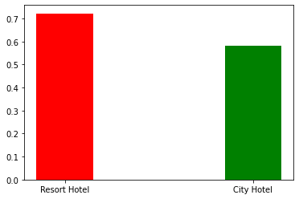
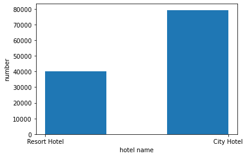
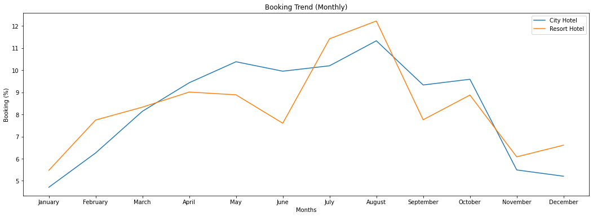

数据挖掘互评作业三 分类、预测与聚类

邱柯铭 3220201078

```python
import csv
import pandas as pd
import numpy as np
import matplotlib.pyplot as plt
import seaborn as sns
```


```python
data = pd.read_csv('C:/Users/15192/Desktop/数据挖掘/hotel_bookings.csv')
data.head()
```


<div>
<style scoped>
    .dataframe tbody tr th:only-of-type {
        vertical-align: middle;
    }

    .dataframe tbody tr th {
        vertical-align: top;
    }
    
    .dataframe thead th {
        text-align: right;
    }
</style>
<table border="1" class="dataframe">
  <thead>
    <tr style="text-align: right;">
      <th></th>
      <th>hotel</th>
      <th>is_canceled</th>
      <th>lead_time</th>
      <th>arrival_date_year</th>
      <th>arrival_date_month</th>
      <th>arrival_date_week_number</th>
      <th>arrival_date_day_of_month</th>
      <th>stays_in_weekend_nights</th>
      <th>stays_in_week_nights</th>
      <th>adults</th>
      <th>...</th>
      <th>deposit_type</th>
      <th>agent</th>
      <th>company</th>
      <th>days_in_waiting_list</th>
      <th>customer_type</th>
      <th>adr</th>
      <th>required_car_parking_spaces</th>
      <th>total_of_special_requests</th>
      <th>reservation_status</th>
      <th>reservation_status_date</th>
    </tr>
  </thead>
  <tbody>
    <tr>
      <th>0</th>
      <td>Resort Hotel</td>
      <td>0</td>
      <td>342</td>
      <td>2015</td>
      <td>July</td>
      <td>27</td>
      <td>1</td>
      <td>0</td>
      <td>0</td>
      <td>2</td>
      <td>...</td>
      <td>No Deposit</td>
      <td>NaN</td>
      <td>NaN</td>
      <td>0</td>
      <td>Transient</td>
      <td>0.0</td>
      <td>0</td>
      <td>0</td>
      <td>Check-Out</td>
      <td>2015-07-01</td>
    </tr>
    <tr>
      <th>1</th>
      <td>Resort Hotel</td>
      <td>0</td>
      <td>737</td>
      <td>2015</td>
      <td>July</td>
      <td>27</td>
      <td>1</td>
      <td>0</td>
      <td>0</td>
      <td>2</td>
      <td>...</td>
      <td>No Deposit</td>
      <td>NaN</td>
      <td>NaN</td>
      <td>0</td>
      <td>Transient</td>
      <td>0.0</td>
      <td>0</td>
      <td>0</td>
      <td>Check-Out</td>
      <td>2015-07-01</td>
    </tr>
    <tr>
      <th>2</th>
      <td>Resort Hotel</td>
      <td>0</td>
      <td>7</td>
      <td>2015</td>
      <td>July</td>
      <td>27</td>
      <td>1</td>
      <td>0</td>
      <td>1</td>
      <td>1</td>
      <td>...</td>
      <td>No Deposit</td>
      <td>NaN</td>
      <td>NaN</td>
      <td>0</td>
      <td>Transient</td>
      <td>75.0</td>
      <td>0</td>
      <td>0</td>
      <td>Check-Out</td>
      <td>2015-07-02</td>
    </tr>
    <tr>
      <th>3</th>
      <td>Resort Hotel</td>
      <td>0</td>
      <td>13</td>
      <td>2015</td>
      <td>July</td>
      <td>27</td>
      <td>1</td>
      <td>0</td>
      <td>1</td>
      <td>1</td>
      <td>...</td>
      <td>No Deposit</td>
      <td>304.0</td>
      <td>NaN</td>
      <td>0</td>
      <td>Transient</td>
      <td>75.0</td>
      <td>0</td>
      <td>0</td>
      <td>Check-Out</td>
      <td>2015-07-02</td>
    </tr>
    <tr>
      <th>4</th>
      <td>Resort Hotel</td>
      <td>0</td>
      <td>14</td>
      <td>2015</td>
      <td>July</td>
      <td>27</td>
      <td>1</td>
      <td>0</td>
      <td>2</td>
      <td>2</td>
      <td>...</td>
      <td>No Deposit</td>
      <td>240.0</td>
      <td>NaN</td>
      <td>0</td>
      <td>Transient</td>
      <td>98.0</td>
      <td>0</td>
      <td>1</td>
      <td>Check-Out</td>
      <td>2015-07-03</td>
    </tr>
  </tbody>
</table>
<p>5 rows × 32 columns</p>
</div>


```python
data.info()
```

    <class 'pandas.core.frame.DataFrame'>
    RangeIndex: 119390 entries, 0 to 119389
    Data columns (total 32 columns):
     #   Column                          Non-Null Count   Dtype  
    ---  ------                          --------------   -----  
     0   hotel                           119390 non-null  object 
     1   is_canceled                     119390 non-null  int64  
     2   lead_time                       119390 non-null  int64  
     3   arrival_date_year               119390 non-null  int64  
     4   arrival_date_month              119390 non-null  object 
     5   arrival_date_week_number        119390 non-null  int64  
     6   arrival_date_day_of_month       119390 non-null  int64  
     7   stays_in_weekend_nights         119390 non-null  int64  
     8   stays_in_week_nights            119390 non-null  int64  
     9   adults                          119390 non-null  int64  
     10  children                        119386 non-null  float64
     11  babies                          119390 non-null  int64  
     12  meal                            119390 non-null  object 
     13  country                         118902 non-null  object 
     14  market_segment                  119390 non-null  object 
     15  distribution_channel            119390 non-null  object 
     16  is_repeated_guest               119390 non-null  int64  
     17  previous_cancellations          119390 non-null  int64  
     18  previous_bookings_not_canceled  119390 non-null  int64  
     19  reserved_room_type              119390 non-null  object 
     20  assigned_room_type              119390 non-null  object 
     21  booking_changes                 119390 non-null  int64  
     22  deposit_type                    119390 non-null  object 
     23  agent                           103050 non-null  float64
     24  company                         6797 non-null    float64
     25  days_in_waiting_list            119390 non-null  int64  
     26  customer_type                   119390 non-null  object 
     27  adr                             119390 non-null  float64
     28  required_car_parking_spaces     119390 non-null  int64  
     29  total_of_special_requests       119390 non-null  int64  
     30  reservation_status              119390 non-null  object 
     31  reservation_status_date         119390 non-null  object 
    dtypes: float64(4), int64(16), object(12)
    memory usage: 29.1+ MB


```python
城市酒店和假日酒店预订需求和入住率比较
```


```python
data.isnull().sum() 
```


    hotel                                  0
    is_canceled                            0
    lead_time                              0
    arrival_date_year                      0
    arrival_date_month                     0
    arrival_date_week_number               0
    arrival_date_day_of_month              0
    stays_in_weekend_nights                0
    stays_in_week_nights                   0
    adults                                 0
    children                               4
    babies                                 0
    meal                                   0
    country                              488
    market_segment                         0
    distribution_channel                   0
    is_repeated_guest                      0
    previous_cancellations                 0
    previous_bookings_not_canceled         0
    reserved_room_type                     0
    assigned_room_type                     0
    booking_changes                        0
    deposit_type                           0
    agent                              16340
    company                           112593
    days_in_waiting_list                   0
    customer_type                          0
    adr                                    0
    required_car_parking_spaces            0
    total_of_special_requests              0
    reservation_status                     0
    reservation_status_date                0
    dtype: int64


```python
data1 = data.copy(deep = True)
data1.drop("company", axis=1, inplace=True)
data1["agent"].fillna(0, inplace=True)
data1["children"].fillna(data1["children"].mode()[0], inplace=True)
data1["country"].fillna(data1["country"].mode()[0], inplace=True)
list = data1.hotel.value_counts()
list
```


    City Hotel      79330
    Resort Hotel    40060
    Name: hotel, dtype: int64


```python
从需求量上来看，城市酒店为79330，而假日酒店为40060,所以城市酒店的需求量较大，远远高于假日酒店
```


```python
rh_iscancel_count = data1[data1["hotel"]=="Resort Hotel"].groupby(["is_canceled"])["is_canceled"].count()
ch_iscancel_count = data1[data1["hotel"]=="City Hotel"].groupby(["is_canceled"])["is_canceled"].count()
```


```python
rh_iscancel_count
```


    is_canceled
    0    28938
    1    11122
    Name: is_canceled, dtype: int64


```python
ch_iscancel_count
```


    is_canceled
    0    46228
    1    33102
    Name: is_canceled, dtype: int64


```python
rh_num = rh_iscancel_count[0]/list['Resort Hotel']
rh_num
```


    0.7223664503245132


```python
ch_num = ch_iscancel_count[0]/list['City Hotel']
ch_num
```


    0.5827303668221354


```python
从入住率上来看，城市酒店为0.58，而假日酒店为0.72，假日酒店的入住率远远高于城市酒店。
```


```python
fig1 = [rh_num,ch_num]
index = np.arange(2)
plt.bar(index, fig1, width=0.3,color='rgb')
plt.xticks(index,('Resort Hotel','City Hotel'))
plt.show()
```

    <ipython-input-17-2d9b2db7e1b3>:3: MatplotlibDeprecationWarning: Using a string of single character colors as a color sequence is deprecated since 3.2 and will be removed two minor releases later. Use an explicit list instead.
      plt.bar(index, fig1, width=0.3,color='rgb')



    


```python

```


```python
fig = plt.figure()
ax = fig.add_subplot(111)
ax.hist(data['hotel'], bins=3)
plt.xlabel('hotel name')
plt.ylabel('number')
plt.show()
```


​    

​    


```python
用户行为：提前预订时间、入住时长、预订间隔、餐食预订情况
```


```python
提前预订时间
```


```python
data1['lead_time'].describe()
```


    count    119390.000000
    mean        104.011416
    std         106.863097
    min           0.000000
    25%          18.000000
    50%          69.000000
    75%         160.000000
    max         737.000000
    Name: lead_time, dtype: float64


```python
平均提前预定时间为104，最小值为0，最大值为737
```


```python
入住时长 =周末停留夜晚数+工作日停留夜晚数
```


```python
data1["total_nights"] = data1["stays_in_weekend_nights"] + data1["stays_in_week_nights"]
```


```python
data1['total_nights'].describe()
```


    count    119390.000000
    mean          3.427900
    std           2.557439
    min           0.000000
    25%           2.000000
    50%           3.000000
    75%           4.000000
    max          69.000000
    Name: total_nights, dtype: float64


```python
平均入住时间为3天，最小值为0天，最大值为69天
```


```python
预订间隔
```


```python
data1['days_in_waiting_list'].describe()
```


    count    119390.000000
    mean          2.321149
    std          17.594721
    min           0.000000
    25%           0.000000
    50%           0.000000
    75%           0.000000
    max         391.000000
    Name: days_in_waiting_list, dtype: float64


```python
平均预定间隔为2，最小值为0，最大值为391
```


```python
餐食预订情况
```


```python
data1['meal'].value_counts()
```


    BB           92310
    HB           14463
    SC           10650
    Undefined     1169
    FB             798
    Name: meal, dtype: int64


```python
多数的餐食预定为BB
```


```python
一年中最佳预订酒店时间
```


```python
new_order = ['January', 'February', 'March', 'April', 'May', 'June', 'July', 'August', 'September', 'October', 'November', 'December']


sorted_months = data1.loc[data1.hotel=='City Hotel' ,'arrival_date_month'].value_counts().reindex(new_order)

x1 = sorted_months.index
y1 = sorted_months/sorted_months.sum()*100


sorted_months = data1.loc[data1.hotel=='Resort Hotel' ,'arrival_date_month'].value_counts().reindex(new_order)

x2 = sorted_months.index
y2 = sorted_months/sorted_months.sum()*100


fig, ax = plt.subplots(figsize=(18,6))

ax.set_xlabel('Months')
ax.set_ylabel('Booking (%)')
ax.set_title('Booking Trend (Monthly)')


sns.lineplot(x1, y1.values, label='City Hotel')
sns.lineplot(x1, y2.values, label='Resort Hotel')

plt.show()
```

    D:\Anaconda\lib\site-packages\seaborn\_decorators.py:36: FutureWarning: Pass the following variables as keyword args: x, y. From version 0.12, the only valid positional argument will be `data`, and passing other arguments without an explicit keyword will result in an error or misinterpretation.
      warnings.warn(
    D:\Anaconda\lib\site-packages\seaborn\_decorators.py:36: FutureWarning: Pass the following variables as keyword args: x, y. From version 0.12, the only valid positional argument will be `data`, and passing other arguments without an explicit keyword will result in an error or misinterpretation.
      warnings.warn(



    


```python
根据酒店的入住情况来看，一年中最佳预订酒店时间为1月和12月，这两月酒店的入住量最低，最适合预定酒店。
```


```python
data1.info()
```

    <class 'pandas.core.frame.DataFrame'>
    RangeIndex: 119390 entries, 0 to 119389
    Data columns (total 32 columns):
     #   Column                          Non-Null Count   Dtype  
    ---  ------                          --------------   -----  
     0   hotel                           119390 non-null  object 
     1   is_canceled                     119390 non-null  int64  
     2   lead_time                       119390 non-null  int64  
     3   arrival_date_year               119390 non-null  int64  
     4   arrival_date_month              119390 non-null  object 
     5   arrival_date_week_number        119390 non-null  int64  
     6   arrival_date_day_of_month       119390 non-null  int64  
     7   stays_in_weekend_nights         119390 non-null  int64  
     8   stays_in_week_nights            119390 non-null  int64  
     9   adults                          119390 non-null  int64  
     10  children                        119390 non-null  float64
     11  babies                          119390 non-null  int64  
     12  meal                            119390 non-null  object 
     13  country                         119390 non-null  object 
     14  market_segment                  119390 non-null  object 
     15  distribution_channel            119390 non-null  object 
     16  is_repeated_guest               119390 non-null  int64  
     17  previous_cancellations          119390 non-null  int64  
     18  previous_bookings_not_canceled  119390 non-null  int64  
     19  reserved_room_type              119390 non-null  object 
     20  assigned_room_type              119390 non-null  object 
     21  booking_changes                 119390 non-null  int64  
     22  deposit_type                    119390 non-null  object 
     23  agent                           119390 non-null  float64
     24  days_in_waiting_list            119390 non-null  int64  
     25  customer_type                   119390 non-null  object 
     26  adr                             119390 non-null  float64
     27  required_car_parking_spaces     119390 non-null  int64  
     28  total_of_special_requests       119390 non-null  int64  
     29  reservation_status              119390 non-null  object 
     30  reservation_status_date         119390 non-null  object 
     31  total_nights                    119390 non-null  int64  
    dtypes: float64(3), int64(17), object(12)
    memory usage: 29.1+ MB


```python
dataframe中的分类数据转化为数值数据
```


```python
data1 = pd.get_dummies(data1)
data1
```


<div>
<style scoped>
    .dataframe tbody tr th:only-of-type {
        vertical-align: middle;
    }

    .dataframe tbody tr th {
        vertical-align: top;
    }
    
    .dataframe thead th {
        text-align: right;
    }
</style>
<table border="1" class="dataframe">
  <thead>
    <tr style="text-align: right;">
      <th></th>
      <th>is_canceled</th>
      <th>lead_time</th>
      <th>arrival_date_year</th>
      <th>arrival_date_week_number</th>
      <th>arrival_date_day_of_month</th>
      <th>stays_in_weekend_nights</th>
      <th>stays_in_week_nights</th>
      <th>adults</th>
      <th>children</th>
      <th>babies</th>
      <th>...</th>
      <th>reservation_status_date_2017-09-03</th>
      <th>reservation_status_date_2017-09-04</th>
      <th>reservation_status_date_2017-09-05</th>
      <th>reservation_status_date_2017-09-06</th>
      <th>reservation_status_date_2017-09-07</th>
      <th>reservation_status_date_2017-09-08</th>
      <th>reservation_status_date_2017-09-09</th>
      <th>reservation_status_date_2017-09-10</th>
      <th>reservation_status_date_2017-09-12</th>
      <th>reservation_status_date_2017-09-14</th>
    </tr>
  </thead>
  <tbody>
    <tr>
      <th>0</th>
      <td>0</td>
      <td>342</td>
      <td>2015</td>
      <td>27</td>
      <td>1</td>
      <td>0</td>
      <td>0</td>
      <td>2</td>
      <td>0.0</td>
      <td>0</td>
      <td>...</td>
      <td>0</td>
      <td>0</td>
      <td>0</td>
      <td>0</td>
      <td>0</td>
      <td>0</td>
      <td>0</td>
      <td>0</td>
      <td>0</td>
      <td>0</td>
    </tr>
    <tr>
      <th>1</th>
      <td>0</td>
      <td>737</td>
      <td>2015</td>
      <td>27</td>
      <td>1</td>
      <td>0</td>
      <td>0</td>
      <td>2</td>
      <td>0.0</td>
      <td>0</td>
      <td>...</td>
      <td>0</td>
      <td>0</td>
      <td>0</td>
      <td>0</td>
      <td>0</td>
      <td>0</td>
      <td>0</td>
      <td>0</td>
      <td>0</td>
      <td>0</td>
    </tr>
    <tr>
      <th>2</th>
      <td>0</td>
      <td>7</td>
      <td>2015</td>
      <td>27</td>
      <td>1</td>
      <td>0</td>
      <td>1</td>
      <td>1</td>
      <td>0.0</td>
      <td>0</td>
      <td>...</td>
      <td>0</td>
      <td>0</td>
      <td>0</td>
      <td>0</td>
      <td>0</td>
      <td>0</td>
      <td>0</td>
      <td>0</td>
      <td>0</td>
      <td>0</td>
    </tr>
    <tr>
      <th>3</th>
      <td>0</td>
      <td>13</td>
      <td>2015</td>
      <td>27</td>
      <td>1</td>
      <td>0</td>
      <td>1</td>
      <td>1</td>
      <td>0.0</td>
      <td>0</td>
      <td>...</td>
      <td>0</td>
      <td>0</td>
      <td>0</td>
      <td>0</td>
      <td>0</td>
      <td>0</td>
      <td>0</td>
      <td>0</td>
      <td>0</td>
      <td>0</td>
    </tr>
    <tr>
      <th>4</th>
      <td>0</td>
      <td>14</td>
      <td>2015</td>
      <td>27</td>
      <td>1</td>
      <td>0</td>
      <td>2</td>
      <td>2</td>
      <td>0.0</td>
      <td>0</td>
      <td>...</td>
      <td>0</td>
      <td>0</td>
      <td>0</td>
      <td>0</td>
      <td>0</td>
      <td>0</td>
      <td>0</td>
      <td>0</td>
      <td>0</td>
      <td>0</td>
    </tr>
    <tr>
      <th>...</th>
      <td>...</td>
      <td>...</td>
      <td>...</td>
      <td>...</td>
      <td>...</td>
      <td>...</td>
      <td>...</td>
      <td>...</td>
      <td>...</td>
      <td>...</td>
      <td>...</td>
      <td>...</td>
      <td>...</td>
      <td>...</td>
      <td>...</td>
      <td>...</td>
      <td>...</td>
      <td>...</td>
      <td>...</td>
      <td>...</td>
      <td>...</td>
    </tr>
    <tr>
      <th>119385</th>
      <td>0</td>
      <td>23</td>
      <td>2017</td>
      <td>35</td>
      <td>30</td>
      <td>2</td>
      <td>5</td>
      <td>2</td>
      <td>0.0</td>
      <td>0</td>
      <td>...</td>
      <td>0</td>
      <td>0</td>
      <td>0</td>
      <td>1</td>
      <td>0</td>
      <td>0</td>
      <td>0</td>
      <td>0</td>
      <td>0</td>
      <td>0</td>
    </tr>
    <tr>
      <th>119386</th>
      <td>0</td>
      <td>102</td>
      <td>2017</td>
      <td>35</td>
      <td>31</td>
      <td>2</td>
      <td>5</td>
      <td>3</td>
      <td>0.0</td>
      <td>0</td>
      <td>...</td>
      <td>0</td>
      <td>0</td>
      <td>0</td>
      <td>0</td>
      <td>1</td>
      <td>0</td>
      <td>0</td>
      <td>0</td>
      <td>0</td>
      <td>0</td>
    </tr>
    <tr>
      <th>119387</th>
      <td>0</td>
      <td>34</td>
      <td>2017</td>
      <td>35</td>
      <td>31</td>
      <td>2</td>
      <td>5</td>
      <td>2</td>
      <td>0.0</td>
      <td>0</td>
      <td>...</td>
      <td>0</td>
      <td>0</td>
      <td>0</td>
      <td>0</td>
      <td>1</td>
      <td>0</td>
      <td>0</td>
      <td>0</td>
      <td>0</td>
      <td>0</td>
    </tr>
    <tr>
      <th>119388</th>
      <td>0</td>
      <td>109</td>
      <td>2017</td>
      <td>35</td>
      <td>31</td>
      <td>2</td>
      <td>5</td>
      <td>2</td>
      <td>0.0</td>
      <td>0</td>
      <td>...</td>
      <td>0</td>
      <td>0</td>
      <td>0</td>
      <td>0</td>
      <td>1</td>
      <td>0</td>
      <td>0</td>
      <td>0</td>
      <td>0</td>
      <td>0</td>
    </tr>
    <tr>
      <th>119389</th>
      <td>0</td>
      <td>205</td>
      <td>2017</td>
      <td>35</td>
      <td>29</td>
      <td>2</td>
      <td>7</td>
      <td>2</td>
      <td>0.0</td>
      <td>0</td>
      <td>...</td>
      <td>0</td>
      <td>0</td>
      <td>0</td>
      <td>0</td>
      <td>1</td>
      <td>0</td>
      <td>0</td>
      <td>0</td>
      <td>0</td>
      <td>0</td>
    </tr>
  </tbody>
</table>
<p>119390 rows × 1187 columns</p>
</div>


```python
def data_split(df, label):
    
    from sklearn.model_selection import train_test_split

    X = df.drop(label, axis=1)
    Y = df[label]

    x_train, x_test, y_train, y_test = train_test_split(X,Y,random_state=0)
    
    return x_train, x_test, y_train, y_test


x_train, x_test, y_train, y_test = data_split(data1, 'is_canceled')
```


```python
按照80%的比例划分训练集和测试集
```


```python
def train(x_train, y_train):
    from sklearn.linear_model import LogisticRegression

    clf = LogisticRegression(random_state = 0, max_iter=100)
    clf.fit(x_train,y_train)
    
    return clf


clf = train(x_train, y_train)
```

    D:\Anaconda\lib\site-packages\sklearn\linear_model\_logistic.py:762: ConvergenceWarning: lbfgs failed to converge (status=1):
    STOP: TOTAL NO. of ITERATIONS REACHED LIMIT.
    
    Increase the number of iterations (max_iter) or scale the data as shown in:
        https://scikit-learn.org/stable/modules/preprocessing.html
    Please also refer to the documentation for alternative solver options:
        https://scikit-learn.org/stable/modules/linear_model.html#logistic-regression
      n_iter_i = _check_optimize_result(


```python
def Score(clf,x_train,y_train,x_test,y_test):
    train_score = clf.score(x_train,y_train)
    test_score = clf.score(x_test,y_test)

    print("========================================")
    print(f'Training Accuracy of our model is: {train_score}')
    print(f'Test Accuracy of our model is: {test_score}')
    print("========================================")
    
    
Score(clf,x_train,y_train,x_test,y_test)
```

    ========================================
    Training Accuracy of our model is: 0.9821647941748006
    Test Accuracy of our model is: 0.9801996783704101
    ========================================


```python
利用logistics模型进行预测，最终模型准确率为99%
```
